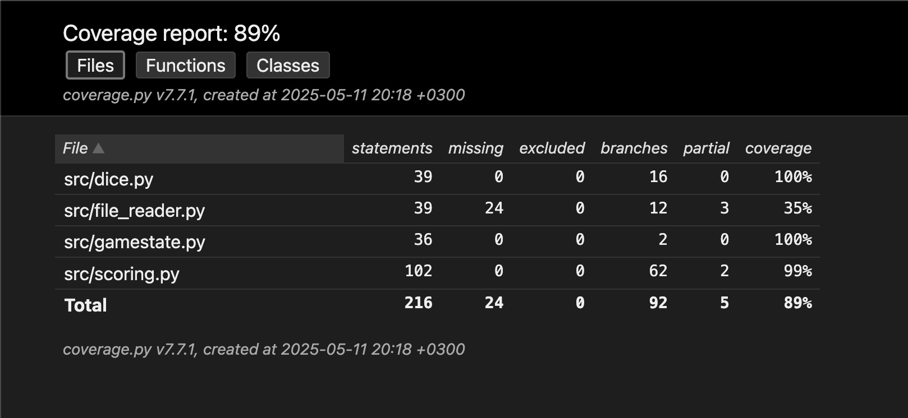

# Testausdokumentti

Ohjelmaa on testattu sekä unittestillä että manuaalisesti peliä pelaamalla.

## Testauskattavuus

Viimeimmän testikattavuusraportin mukaan testikattavuus on 89%. Testaamatta jäi pääosin FileReader-luokan toiminnallisuus. Tämä on kuitenkin manuaalisesti testattu toimivaksi ohjelman puitteissa.

Testikattavatuuden ulkopuolelle on jätetty UI-luokka, eli käyttöliittymän toiminnallisuus. Tämän automaattinen testaaminen olisi tullut liian monimutkaiseksi. Käyttöliittymän ulkonäkö ja toiminnallisuus on kuitenkin testattu manuaalisesti tomivaksi sekä Macos että Linux käyttöjärjestelmillä.

## Järjestelmätestaus

Järjestelmätestaus on suoritettu manuaalisesti. Ohjelma on ladattu koneelle sekä Macos että Linux käyttöjärjestelmillä ohjeiden mukaisella tavalla. Testattu erityisesti, että tilanteessa, jossa data-kansiota ja/tai sen sisältämää scores.csv-tiedostoa ei ole olemassa (kuten peliä ensi kertaa pelatessa) ohjelma osaa luoda puuttuvat tiedostot.

## Ohjelmaan jääneitä bugeja ja laatuongelmia

- Pelin lopuksi käyttäjän syöttäessä nimimerkkiään käyttäjän syötettä ei ole suodatettu muuten kuin pilkun osalta. Tämän vuoksi tietyt erikoismerkit saattavat rikkoa csv-tiedoston järjestelyn.
- Käyttöliittymän ikkunoiden koko vaihtelee eri käyttöjärjestelmien välillä ilmeisesti käyttöjärjestelmän fonttien mukaan. Tämän vuoksi ikkunat saattavat joskus avautua liian pieninä.
- Ohjelman toimintaa ei ole testattu Windows-käyttöjärjestelmällä.